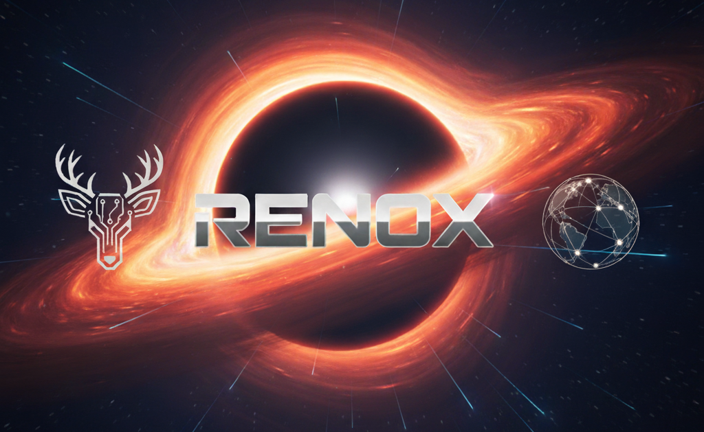

# Hi there, I am Renato or you can call me RenOX👋

The reason I am here on GitHub is that I want to contribute with other programmers and share my personal projects with the worldwide community. 

  
  
  

  

### 🌐 Connect with me

<!--
**ORenox/ORenox** is a ✨ _special_ ✨ repository because its `README.md` (this file) appears on your GitHub profile.

Here are some ideas to get you started:

- 🔭 I’m currently working on ...
- 🌱 I’m currently learning ...
- 👯 I’m looking to collaborate on ...
- 🤔 I’m looking for help with ...
- 💬 Ask me about ...
- 📫 How to reach me: ...
- 😄 Pronouns: ...
- ⚡ Fun fact: ...
-->

